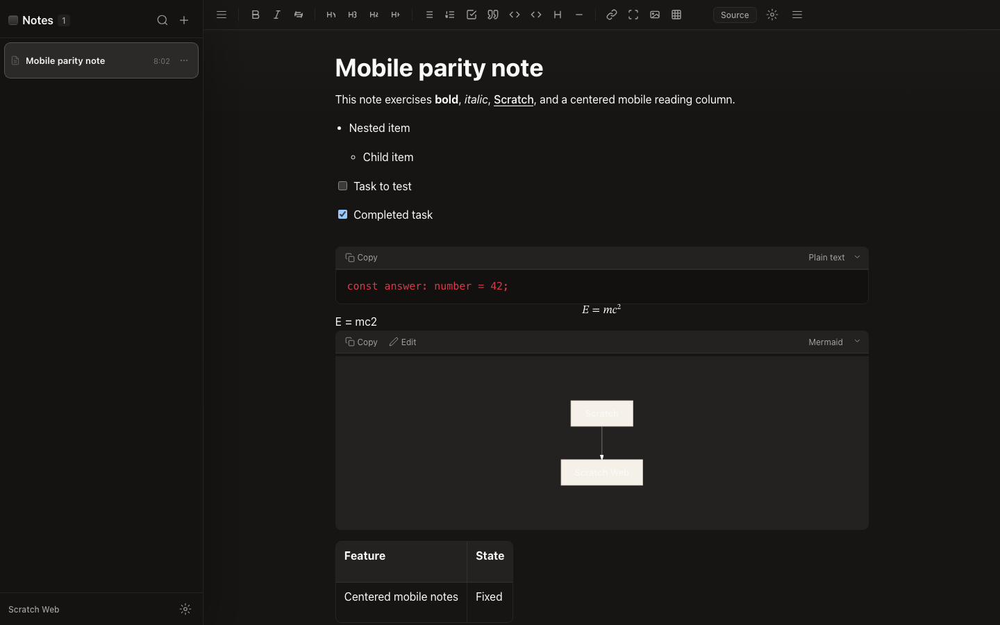
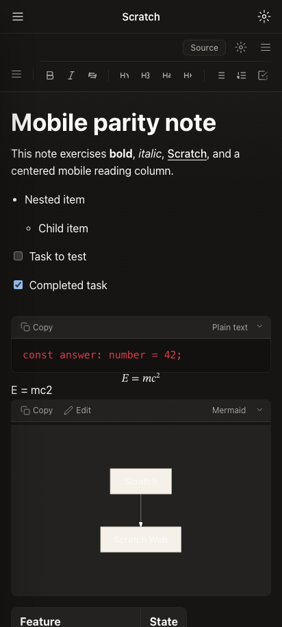

# Scratch Web

[](https://github.com/kartikkabadi/scratch-web/actions/workflows/ci.yml)

Scratch Web is an experimental, unofficial web companion for
[Scratch](https://github.com/erictli/scratch) by erictli.

Scratch Web would not be possible without Scratch. Scratch is the original
minimal, offline-first markdown note-taking app; Scratch Web exists to make that
same notes experience reachable from phones and other devices through a private
Mac-hosted web bridge.

## Status

Experimental beta and open source under MIT. This project writes directly to
your Scratch notes folder, so safety, backups, and conflict detection are core
requirements.

Current development focus: private beta ship readiness. M3 practical Scratch
parity, automated M4 re-smoke, isolated real-world QA, safe Scratch-folder
write-cycle smoke, Android Chrome device smoke, and desktop browser smoke have
landed. iPhone Safari was explicitly skipped for this ship decision. See
[docs/SHIP_READINESS.md](docs/SHIP_READINESS.md).
The prompt-to-evidence audit lives in
[docs/COMPLETION_AUDIT.md](docs/COMPLETION_AUDIT.md).

## Screenshots

The screenshots below use an isolated demo notes folder, not private notes.

| Desktop | Mobile browser |
| --- | --- |
|  |  |

Capture details live in [docs/RELEASE_SCREENSHOTS.md](docs/RELEASE_SCREENSHOTS.md).

## What It Does

- Run on your Mac as a local background service.
- Read and write the same local notes folder used by Scratch.
- Expose the app privately through Tailscale Serve.
- Provide a mobile-first web/PWA interface for iPhone Safari and Android Chrome.
- Keep desktop web functional, but secondary to mobile.

## What It Will Not Do In v1

- Host your notes in the cloud.
- Use Tailscale Funnel or public internet exposure by default.
- Provide phone-side offline editing/sync.
- Access arbitrary iCloud folders directly from a browser.
- Add in-app AI note-editing features.

## Recommended Setup Model

The intended setup flow is agent-guided. A non-technical user should be able to
paste one prompt into Codex, Claude Code, OpenCode, Hermes, or a similar coding
agent. The agent will read `llms.txt` and `docs/AGENT_SETUP.md`, explain what it
will do, ask before sensitive actions, and guide setup.

The one-line installer will exist as a convenience path, but public docs should
prefer a tagged release URL with checksum/signature verification.

## Attribution

Scratch Web is independent and unofficial unless that changes upstream. Scratch
by erictli is the upstream product inspiration and behavioral reference. See
[NOTICE.md](NOTICE.md) and [docs/ATTRIBUTION.md](docs/ATTRIBUTION.md).

## Development

```bash
pnpm install
pnpm check
pnpm build
pnpm qa:realworld
pnpm scratch-web doctor
```

## Local Setup Commands

```bash
scratch-web setup --notes-folder "/path/to/Scratch notes"
scratch-web doctor
scratch-web device-smoke
scratch-web launchagent install --yes
scratch-web tailscale serve --yes
```

`--yes` is required for LaunchAgent and Tailscale Serve changes so agents cannot
silently modify login services or network exposure.

If your Scratch folder is in iCloud Drive, use `scratch-web start` instead of
installing the LaunchAgent for now. macOS can hang note reads from launchd for
iCloud-backed folders; the CLI refuses that install path by default.

No frontend/UI implementation should be done directly by Codex. Frontend work is
delegated to OpenCode using the maintained brief in
[docs/FRONTEND_OPENCODE_BRIEF.md](docs/FRONTEND_OPENCODE_BRIEF.md).
